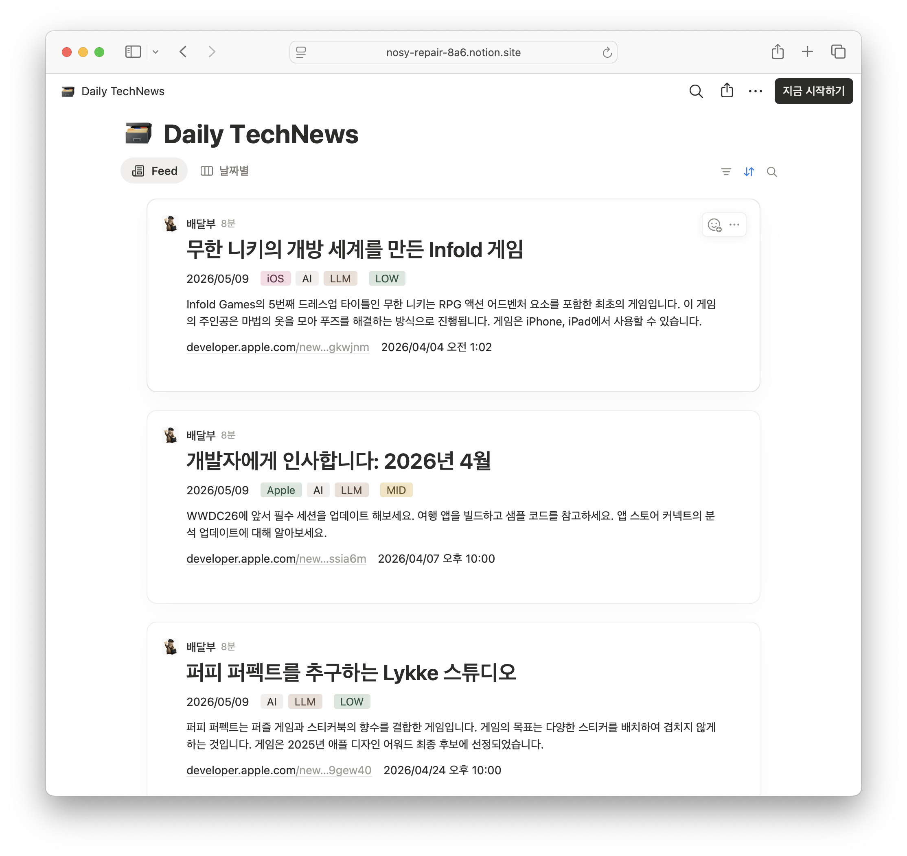
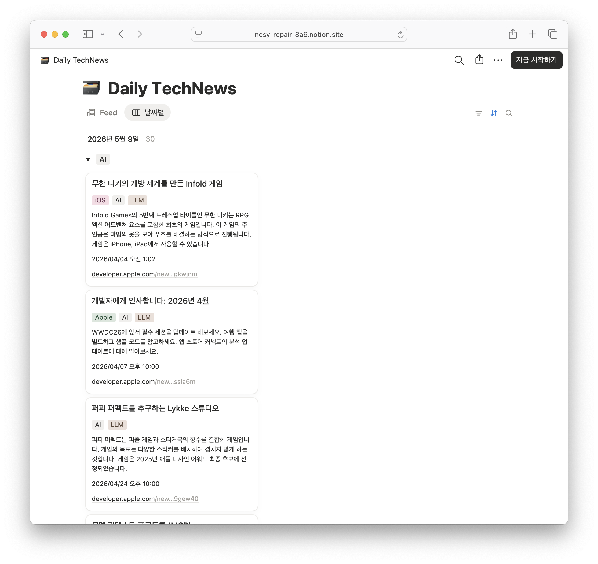

# Daily TechNews MVP

iOS/AI 개발자를 위한 개인 테크 뉴스 브리핑 자동화 시스템입니다.
매일 오전 7시에 최신 기술 뉴스를 수집하고 AI로 요약해 Notion에 자동 저장합니다.

**[→ Notion에서 보기](https://nosy-repair-8a6.notion.site/35b5d493ce9a803f94a1fafb18b4a266?v=35b5d493ce9a80c3b1a1000c526fb40b&source=copy_link)**

---

## 미리보기

두 가지 뷰를 제공합니다.

**Feed** — 전체 기사 목록을 최신순으로 확인합니다.



**날짜별** — 수집일 기준으로 날짜별 그룹핑, Tag별로 분류해서 확인합니다.



---

## 용도

- 매일 아침 Notion을 열면 오늘의 테크 뉴스 브리핑이 준비되어 있습니다.
- iOS, AI, LLM, Apple 등 관심 분야 키워드로 필터링된 뉴스만 수집합니다.
- 영문 기사를 한국어 제목 + 3줄 요약으로 제공합니다.
- Tags(multi-select)로 분야별 필터링이 가능합니다.

---

## 파이프라인

```
RSS 수집
 - 일반 피드 (Hacker News, TechCrunch AI) → 키워드 필터링 적용
 - iOS 전문 피드 (SwiftLee, Hacking with Swift, NSHipster, Apple Developer News) → 전체 수집
↓
Groq(Llama 3) → 한국어 제목 번역 + 3줄 요약 + 중요도 + 태그
↓
Notion DB 저장
↓
매일 오전 7시 자동 실행 (GitHub Actions)
```

---

## Notion DB 구조

| 컬럼 | 타입 | 설명 |
|---|---|---|
| Title | title | 한국어로 번역된 기사 제목 |
| Summary | text | 3줄 요약 |
| Importance | select | HIGH / MID / LOW |
| Tags | multi-select | iOS, AI, LLM, Apple 등 분야 태그 |
| Source | select | 출처 (Hacker News, TechCrunch AI, SwiftLee, Hacking with Swift, NSHipster, Apple Developer News) |
| URL | url | 원문 링크 |
| Published At | date | 기사 원발행일 |
| Briefed At | date | 수집일 (날짜별 브리핑 구분용) |

---

## 로컬 실행

### 환경 설정

```bash
npm install
```

`.env` 파일 생성 후 API 키를 입력합니다.

```
GROQ_API_KEY=발급받은_Groq_키
NOTION_API_KEY=발급받은_Notion_키
NOTION_DB_ID=Notion_DB_ID
```

### Notion DB 초기 세팅 (최초 1회)

```bash
npm run setup
```

### 뉴스 수집 및 Notion 저장

```bash
npm start
```

### 미리보기 (상위 3개 콘솔 출력)

```bash
npm run preview
```

---

## 자동화 (GitHub Actions)

매일 오전 7시 KST에 자동 실행됩니다.
GitHub 레포 → Settings → Secrets에 아래 3개를 등록해야 합니다.

| Secret | 설명 |
|---|---|
| `GROQ_API_KEY` | Groq API 키 |
| `NOTION_API_KEY` | Notion Integration 키 |
| `NOTION_DB_ID` | Notion DB ID |

Actions 탭 → Daily TechNews Brief → Run workflow로 수동 실행도 가능합니다.

---

## 기술 스택

- **Runtime**: Node.js + TypeScript
- **AI 요약**: Groq (Llama 3.1 8B) — 무료
- **뉴스 수집**: rss-parser
- **Notion 연동**: @notionhq/client
- **자동화**: GitHub Actions
